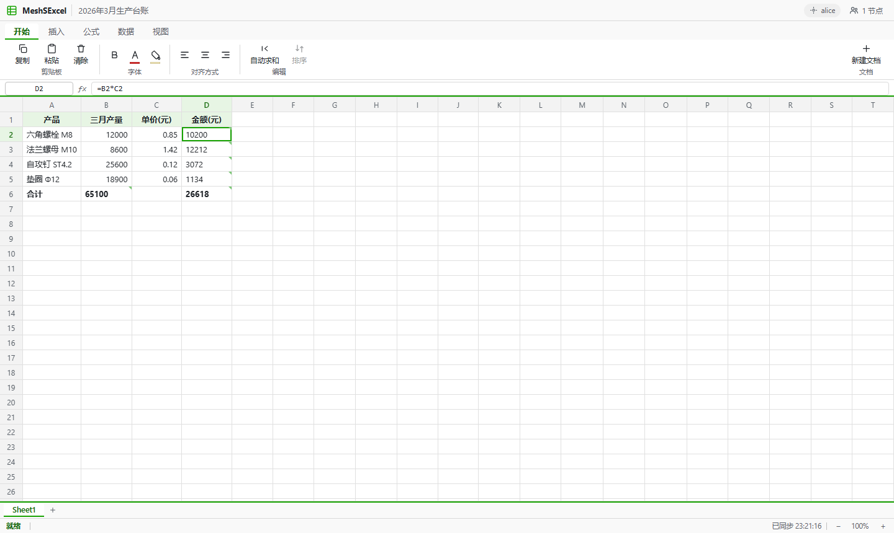

# MeshSExcel

[](https://github.com/GreenChennai/MeshSExcel/actions/workflows/ci.yml)

MeshSExcel 是一个面向局域网内企业协作的在线办公表格软件,聚焦在:

- 局域网 P2P 同步(mDNS 自动发现 + gossipsub 广播)
- 表格编辑与实时协作(单元格级 LWW 合并,乱序到达也收敛)
- 区块链式审计链 / 不可篡改变更日志(ed25519 签名,逐块校验)
- 公式计算(SUM/AVERAGE/IF 等,依赖图增量重算)
- XLSX / CSV 导入导出(公式写成真公式,WPS / Excel 可直接重算)
- 单二进制交付:REST API + 内嵌 Web UI + SQLite 存档

Web 端表格组件采用开源的 **Luckysheet**(MIT)——完整办公级交互:工具栏、
名称框 + 编辑栏、右键菜单、列宽拖拽、撤销重做、合并/筛选/排序、底部统计栏、
多工作表标签,内嵌进单二进制(经 iframe 隔离 + postMessage 与协同层适配)。



## 当前实现状态(2026-10)

按 `PROJECT_ARCHIVE_INDEX.md` 的推进顺序:

| 阶段 | 状态 | 说明 |
|------|------|------|
| 第一阶段:PoC(P2P + Block + 存档) | ✅ 完成 | `poc-b-rust`,多节点 mDNS/gossipsub 演示 |
| 第二阶段:MVP(表格 + 公式 + UI + XLSX) | ✅ 完成 | `crates/meshsexcel-*`,见下方"运行" |
| 第三阶段:企业版(权限 / LDAP / 监控) | 规划中 | 见 PROJECT_ARCHIVE_INDEX 第十一节 |

工程说明:

- `meshsexcel-core`:block 审计链、LWW 操作合并、公式引擎、SQLite 存储层(按 `spec/sqlite_schema.sql` 建表)、XLSX/CSV 导入导出
- `meshsexcel-net`:libp2p + mDNS + gossipsub 网络栈(PoC 与正式节点共用)
- `meshsexcel-node`:局域网表格节点(axum REST API + 内嵌 Web UI)
- `poc-b-rust`:最小多节点演示(与正式节点同一套 block/网络语义)
- `spec/`:REST API(openapi.yaml)、P2P 协议(block.proto)、存储 schema(sqlite_schema.sql)

> 原脚手架的 RocksDB 属"高性能核心"规划;MVP 按规范里的轻量桌面路线用 SQLite 落地。
> 协同层按文档建议采用 CRDT(单元格级 LWW 寄存器);HyperFormula/Yjs(前端 JS 生态)
> 替换为 Rust 内置公式引擎 + 内嵌 UI,换来零构建链、单二进制局域网部署。

## 运行

### 本地桌面端(Windows,推荐体验)

安装 [LibreOffice](https://www.libreoffice.org/) 后,桌面端即完整的 **LibreOffice Calc**:
原生公式引擎、全套办公交互,MeshSExcel 在其下做协同与审计:

```cmd
meshsexcel --node-id alice --db-dir ./data/alice
office-bridge\start-bridge.cmd
```

弹出的 Calc 窗口像平常一样编辑,每次变更自动签名上链并同步;其他节点的
修改实时回显。详见 `office-bridge/README.md`。

### Web 端(局域网任意浏览器)

```bash
# 节点 A(本机)
cargo run -p meshsexcel-node -- --node-id alice --db-dir ./data/alice --http-port 8443 --p2p-port 20001

# 节点 B(局域网另一台机器,或本机另开端口)
cargo run -p meshsexcel-node -- --node-id bob --db-dir ./data/bob --http-port 8444 --p2p-port 20002
```

浏览器打开 `http://localhost:8443`:新建文档、编辑公式自动上链;多节点自动
互发现同步;审计历史 / 快照 / XLSX / CSV 导入导出。

PoC B(纯网络演示,无 UI):

```bash
cargo run -p meshsexcel-poc-b -- --node-id alice --db-dir ./tmp/alice --port 20001
```

## REST API

实现 `spec/openapi.yaml` 全部端点,另有供 Web UI 使用的扩展端点(cells 网格、
ops 批量提交、快照、导入),详见 `spec/README.md`。

## 开发与构建

```bash
cargo test --workspace      # 单元 + API 集成测试
cargo clippy --all-targets -- -D warnings
cargo build --release       # 产物:target/release/meshsexcel.exe
```

## GitHub 构建(CI / 发布)

- **CI**(`.github/workflows/ci.yml`):每次 push / PR 自动跑
  fmt + clippy + 全量测试(ubuntu),并在 Windows 上构建 +
  启动冒烟,产物(`meshsexcel.exe` / `meshsexcel-poc-b.exe`)
  上传为 Actions Artifacts。
- **发布**(`.github/workflows/release.yml`):推送 `v*` 标签触发,
  Windows release 构建 + 冒烟 + 打包 zip,自动创建 GitHub Release。

发布一个版本:

```bash
git tag v0.2.0 && git push origin v0.2.0
```

## 目录

- `PROJECT_ARCHIVE_INDEX.md` — 主入口文档,整体设计、架构与推进路线
- `spec/` — API、协议、schema 与数据模型设计
- `crates/` — 正式实现(core / net / node)
- `poc-b-rust/` — 多节点网络 PoC
- `docs/` — 可用轮子、参考项目与开发建议
- `LICENSE` — artboard 的 ACL-1.0 自定义协议

## License

本仓库使用与 artboard 一致的自定义协议:ACL-1.0(Artboard Community License, Version 1.0)。

完整协议见 `LICENSE`。
